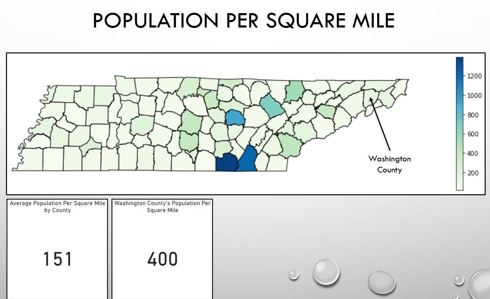
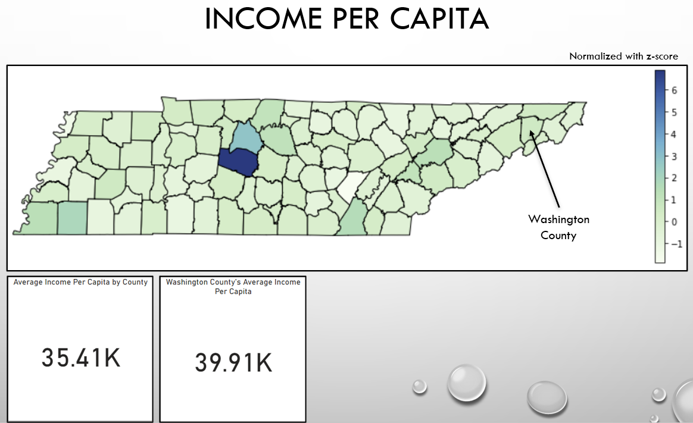
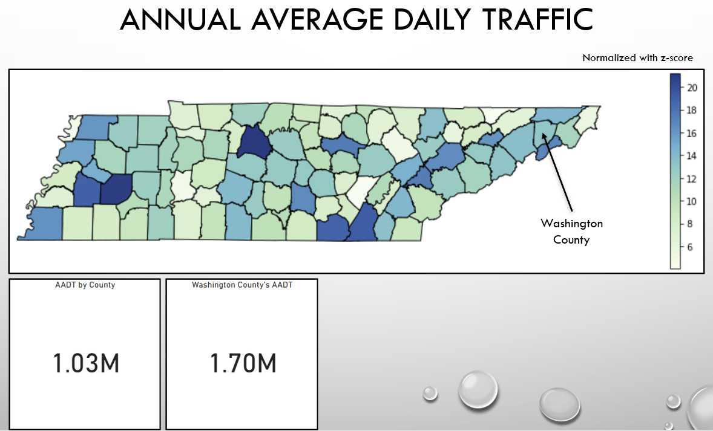
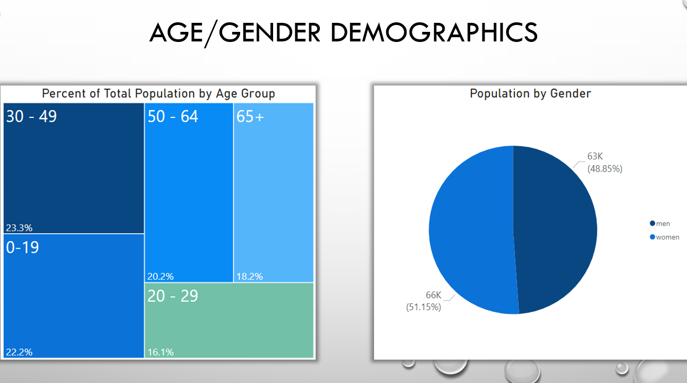
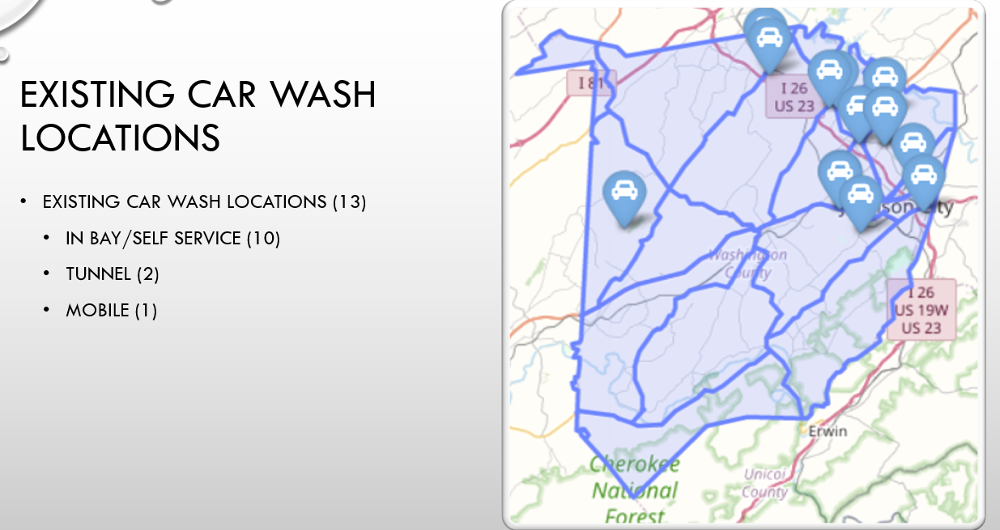
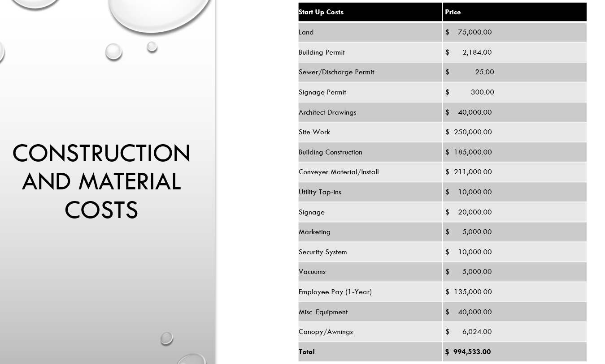
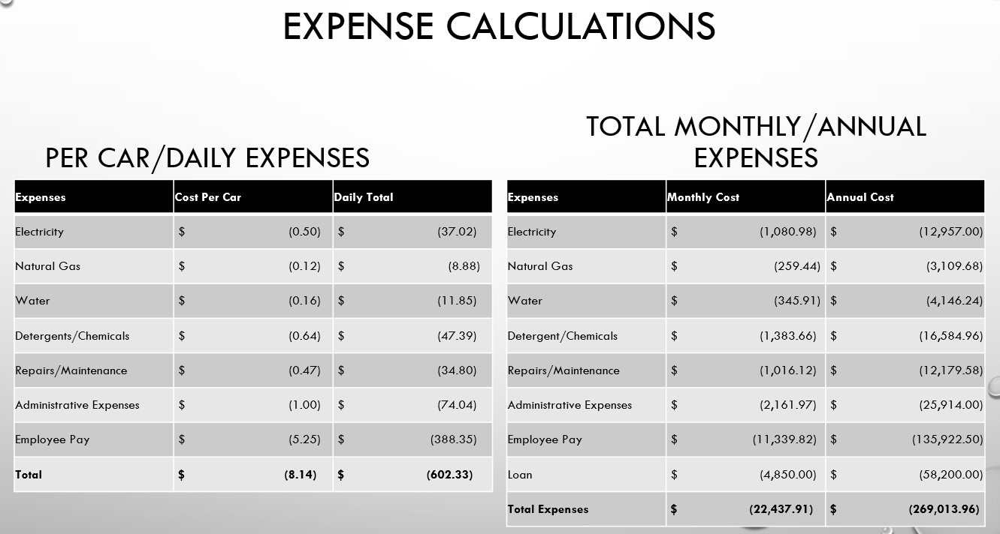

<h1 align="center">Full Service Car Wash Location Analysis</h1>
<h3 align="center">Motivation</h3>

I have always had a fascination with cars.  Keeping my car clean and seeing cars shine has always been something that I have enjoyed.  I want to own a full-service car wash and help keep cars looking their best!</b3>
 
<h3 align="center">Data Questions</h3>

What is the best location for a car wash?</b3>

Can the location support a car wash?</b3>

What is needed for a success?</b3>

Is the location over-saturated with car washes?</b3>

Location Strengths?</b3>

What are the 1-year financial projections?</b3>

<h3 align="center">Data Sources</h3>

I requested traffic data from TDOT in order to analyze the Annual Average Daily Traffic (AADT).  Data on existing car wash locations were pulled from the Google Places API.  Demographic data was downloaded for Census Reporter.  Income per capita was retrieved from Tennessee's Government site.  World Population Review provided me with the population for the desired counties.  Index Mundi was utilized to determine the county sizes by square miles.</b3>

<h3 align="center">Overview of Analysis</h3>

I began by creating a code in python to pull all car wash locations from the Google Places API.  I created chorpleth maps to visualize the population, income per capita, and AADT for all counties in Tennessee.  I then moved to researching available land prices and using Google Places API to choose the best county for a full-service car wash startup.  I broke down the county's existing car wash locations into the different kinds of car washes to look at competiton in the area.  I used the traffic data to determine if the chosen location would have enough daily traffic to support a car wash.  Once the location was chosen,  I began putting together the financial projections.  This involved conducting research from many sources to determine average prices for a car wash start-up.</b3>

<h3 align="center">Analysis</h3>

  
\
\
\

\
\
\

\
\
\

\
\
\

\
\
\

\
\
\

<h3 align="center">Conclusion</h3>

There are many great counties in Tennessee that would be great for a car wash.  However, a start-up car wash cannot realistically afford some of the better locations due to overall cost.  I chose Washington County as the location for a new start-up car wash.  The strengths of Washington County are above average population and income per capita, an AADT of more than 15,000, affordable real estate, and low competition.  The car wash is projected to turn profit in the opening year.</b3>
